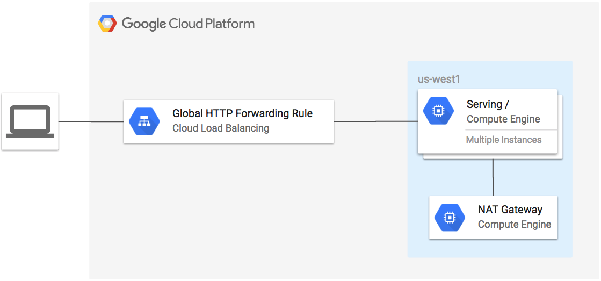
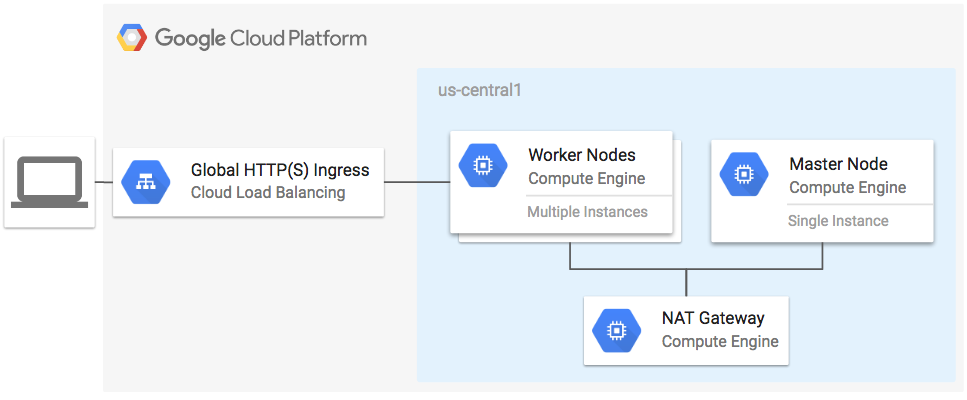

Google Cloud Platform Terraform module examples
=====

Collection of examples for using Terraform with Google Cloud Platform.

__Table of Contents__

1. [example-lb](#example-lb)
1. [example-lb-http](#example-lb-http)
1. [example-lb-https-gke](#example-lb-https-gke)
1. [example-lb-http-nat-gateway](#example-lb-http-nat-gateway)
1. [example-lb-https-content](#example-lb-https-content)
1. [example-lb-internal](#example-lb-internal)
1. [example-k8s-gce](#example-k8s-gce)

## [example-lb](./example-lb)

**Figure 1.** *example-lb diagram*

</img>

Modules used:

- [terraform-google-managed-instance-group](https://github.com/GoogleCloudPlatform/terraform-google-managed-instance-group)
- [terraform-google-lb](https://github.com/GoogleCloudPlatform/terraform-google-lb)

## [example-lb-http](./example-lb-http)

**Figure 1.** *example-lb-http diagram*

</img>

Modules used:

- [terraform-google-managed-instance-group](https://github.com/GoogleCloudPlatform/terraform-google-managed-instance-group)
- [terraform-google-lb-http](https://github.com/GoogleCloudPlatform/terraform-google-lb-http)

## [example-lb-https-gke](./example-lb-https-gke)

**Figure 1.** *example-lb-https-gke diagram*

</img>

Modules used:

- [terraform-google-lb-http](https://github.com/GoogleCloudPlatform/terraform-google-lb-http)

## [example-lb-http-nat-gateway](./example-lb-http-nat-gateway)

**Figure 1.** *example-lb-http-nat-gateway diagram*

</img>

Modules used:

- [terraform-google-managed-instance-group](https://github.com/GoogleCloudPlatform/terraform-google-managed-instance-group)
- [terraform-google-lb-http](https://github.com/GoogleCloudPlatform/terraform-google-lb-http)
- [terraform-google-nat-gateway](https://github.com/GoogleCloudPlatform/terraform-google-nat-gateway)

## [example-lb-https-content](./example-lb-https-content)

**Figure 1.** *example-lb-https-content diagram*

</img>

Modules used:

- [terraform-google-managed-instance-group](https://github.com/GoogleCloudPlatform/terraform-google-managed-instance-group)
- [terraform-google-lb-http](https://github.com/GoogleCloudPlatform/terraform-google-lb-http)

## [example-lb-internal](./example-lb-internal)

**Figure 1.** *example-lb-internal diagram*

</img>

Modules used:

- [terraform-google-managed-instance-group](https://github.com/GoogleCloudPlatform/terraform-google-managed-instance-group)
- [terraform-google-lb](https://github.com/GoogleCloudPlatform/terraform-google-lb)
- [terraform-google-lb-internal](https://github.com/GoogleCloudPlatform/terraform-google-lb-internal)

## [example-k8s-gce](./example-k8s-gce)

**Figure 1.** *example-k8s-gce diagram*

</img>

Modules used:

- [terraform-google-k8s-gce](https://github.com/GoogleCloudPlatform/terraform-google-k8s-gce)
- [terraform-google-nat-gateway](https://github.com/GoogleCloudPlatform/terraform-google-nat-gateway)

## [example-gke-nat-gateway](./example-gke-nat-gateway)

**Figure 1.** *example-gke-nat-gateway diagram*

</img>

Modules used:

- [terraform-google-nat-gateway](https://github.com/GoogleCloudPlatform/terraform-google-nat-gateway)