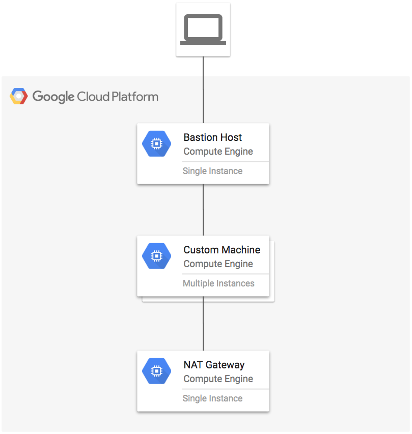

# Custom Machine Types

[](https://console.cloud.google.com/cloudshell/open?git_repo=https://github.com/GoogleCloudPlatform/terraform-google-examples&working_dir=example-custom-machine-types&page=shell&tutorial=README.md)

This example creates an instance with a custom machine type, a bastion host and a NAT gateway.

**Figure 1.** *diagram of Google Cloud resources*



## Change to the example directory

```
[[ `basename $PWD` != example-custom-machine-types ]] && cd example-custom-machine-types
```

## Install Terraform

1. Install Terraform if it is not already installed (visit [terraform.io](https://terraform.io) for other distributions):

```
../terraform-install.sh
```

## Set up the environment

1. Set the project, replace `YOUR_PROJECT` with your project ID:

```
PROJECT=YOUR_PROJECT
```

```
gcloud config set project ${PROJECT}
```

2. Configure the environment for Terraform:

```
[[ $CLOUD_SHELL ]] || gcloud auth application-default login
export GOOGLE_PROJECT=$(gcloud config get-value project)
```

## Configure remote backend

1. Configure Terraform [remote backend](https://www.terraform.io/docs/backends/types/gcs.html) for the state file.

```
BUCKET=${GOOGLE_PROJECT}-terraform
gsutil mb gs://${BUCKET}

PREFIX=tf-es-custom-machine/state
```

```
cat > backend.tf <<EOF
terraform {
  backend "gcs" {
    bucket     = "${BUCKET}"
    prefix     = "${PREFIX}"
  }
}
EOF
```

## Run Terraform

```
terraform init
terraform apply
```

## Testing

1. SSH into the bastion host with port forwarding to Cerebro and Kibana:

```
eval $(ssh-agent)
ssh-add ~/.ssh/google_compute_engine
eval $(terraform output bastion)
```

2. SSH into the custom machine:

```
ssh tf-custom-1
```

3. Verify external IP is the IP of the NAT gateway:

```
curl http://ipinfo.io/ip
```

## Cleanup

1. Exit the ssh sessions:

```
exit
```

2. Remove all resources created by terraform:

```
terraform destroy
```
