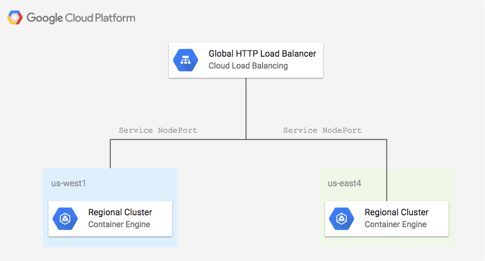

# Kubernetes Engine Multi Cluster Load Balancing

This example shows how to do multi-region ingress using an L7 HTTP Load Balancer with regional clusters.

[](https://console.cloud.google.com/cloudshell/open?git_repo=https://github.com/GoogleCloudPlatform/terraform-google-examples&working_dir=example-gke-k8s-multi-region&page=shell&tutorial=README.md)

<a href="https://concourse-tf.gcp.solutions/teams/main/pipelines/tf-examples-gke-multi-region" target="_blank">
</a>

**Figure 1.** *diagram of Google Cloud resources*



## Change to the example directory

```
[[ `basename $PWD` != example-gke-k8s-multi-region ]] && cd example-gke-k8s-multi-region
```

## Install Terraform

1. Install Terraform if it is not already installed (visit [terraform.io](https://terraform.io) for other distributions):

```
../terraform-install.sh
```

## Set up the environment

1. Set the project, replace `YOUR_PROJECT` with your project ID:

```
PROJECT=YOUR_PROJECT
```

```
gcloud config set project ${PROJECT}
```

2. Configure the environment for Terraform:

```
[[ $CLOUD_SHELL ]] || gcloud auth application-default login
export GOOGLE_PROJECT=$(gcloud config get-value project)
```

## Run Terraform

```
terraform init
terraform apply
```

## Testing

1. Wait for the load balancer to be provisioned:

```
./test.sh
```

2. Open the address of the load balancer:

```
echo http://$(terraform output load-balancer-ip)
```

## Cleanup

1. Delete resources created by terraform:

```
terraform destroy
```