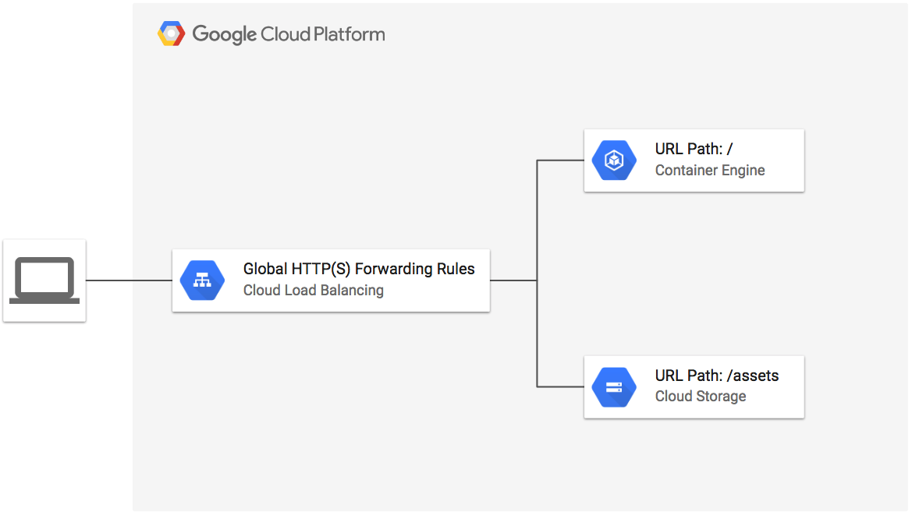

# HTTPS load balancer with existing GKE cluster example

This example creates an HTTPS load balancer to forward traffic to a custom URL map. The URL map sends traffic to the `NodePort` of a Kubernetes service running on a GKE cluster. The `/assets` URL map path points to images stored in a Cloud Storage bucket. The TLS key and certificate is generated by Terraform using the [TLS provider](https://www.terraform.io/docs/providers/tls/index.html).

**Figure 1.** *diagram of Google Cloud resources*



## Set up the environment

```
gcloud auth application-default login
export GOOGLE_PROJECT=$(gcloud config get-value project)
```

## Manually create GKE cluster (without Terraform)

In this example, we'll create a GKE cluster using the Cloud SDK and a Kubernetes `NodePort` service on port `30000` to route traffic to the [`example-app`](./k8s/example-app).

Create the GKE cluster named `dev` in zone `us-central1-f` with additional tags `gke-dev` used for load balancing:

```
CLUSTER_NAME=dev

gcloud container clusters create ${CLUSTER_NAME} --num-nodes=3 --machine-type f1-micro --zone us-central1-f --tags gke-${CLUSTER_NAME}
```

> Remember to include the `--tags` argument so that the network rules apply.

Deploy the example app that shows instance info with https redirection:

```
kubectl create -f example-app/
```

Find the URI of the instance groups for the GKE cluster, the groups created by GKE are prefixed with your cluster name:

```
INSTANCE_GROUP_URI=$(gcloud container clusters describe ${CLUSTER_NAME} --format 'value(instanceGroupUrls[0])' | sed 's/instanceGroupManagers/instanceGroups/')
```

Export the instance group URI as a Terraform environment variable:

```
export TF_VAR_backend=${INSTANCE_GROUP_URI}
```

Add a named port for the load balancer to the instance group:

```
gcloud compute instance-groups set-named-ports ${TF_VAR_backend} --named-ports=http:30000
```

> Backend Services use named ports to forward traffic and must be applied to the instance group.

## Run Terraform

```
terraform init
terraform plan
terraform apply
```

Open URL of load balancer in browser:

```
EXTERNAL_IP=$(terraform output -module gce-lb-http | grep external_ip | cut -d = -f2 | xargs echo -n)
open http://${EXTERNAL_IP}/
```

> Note that it may take several minutes for the global load balancer to be provisioned.

You should see the Google Cloud logo (served from Cloud Storage) and instance details for the sample-app running in the GKE cluster.

## Cleanup

```
terraform destroy
```

Delete the sample app:

```
kubectl delete -f sample-app
```

Delete the GKE cluster:

```
gcloud container clusters delete ${CLUSTER_NAME}
```