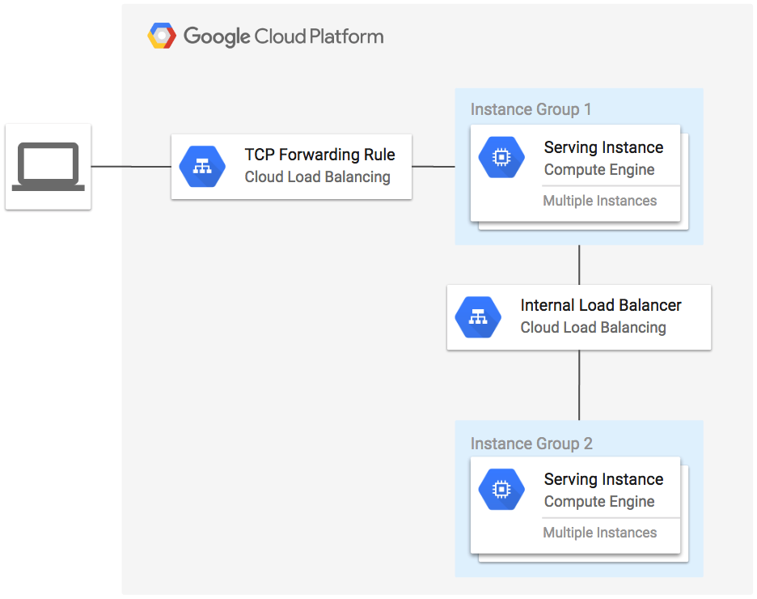

# Internal Load Balancer Example

This example creates 3 instance groups. The first group is in us-central1-b and uses the internal load balancer to proxy access to services running in instance groups 2 and 3 which exist in us-central1-c and us-central1-f respectively. A regional TCP load balancer is also used to forward external traffic to the instances in group 1.

**Figure 1.** *diagram of Google Cloud resources*



## Set up the environment

```
gcloud auth application-default login
export GOOGLE_PROJECT=$(gcloud config get-value project)
```

## Run Terraform

```
terraform init
terraform plan
terraform apply
```

Open URL of load balancer in browser:

```
EXTERNAL_IP=$(terraform output -module gce-lb-fr | grep external_ip | cut -d = -f2 | xargs echo -n)
open http://${EXTERNAL_IP}
```

You should see the instance details from `group2` proxied through `group1` and the internal load balancer.
