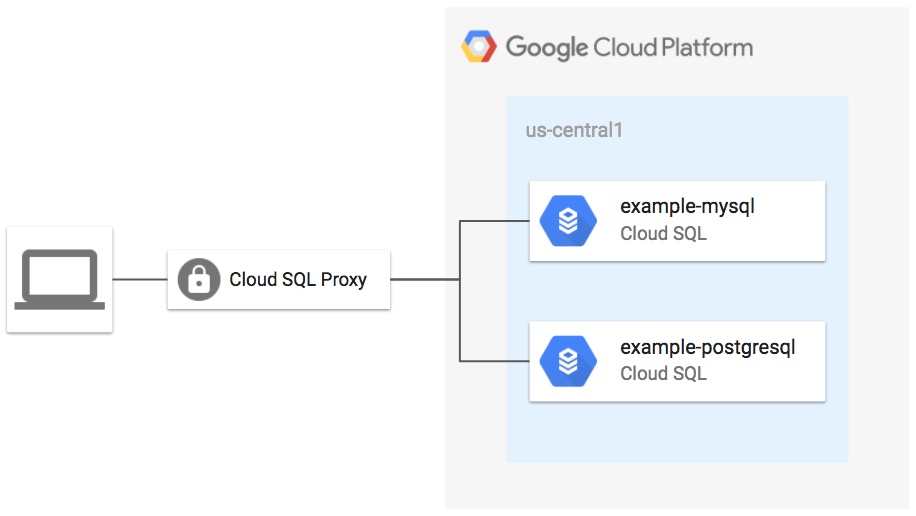

# Cloud SQL Database Example

This example shows how create Cloud SQL databases for for MySQL and PostgreSQL using the Terraform module.

**Figure 1.** *diagram of Google Cloud resources*



## Run Terraform

```
terraform init
terraform plan
terraform apply
```

## Test connection to database

Install the Cloud SQL Proxy: https://cloud.google.com/sql/docs/mysql/sql-proxy#install

Run the Cloud SQL proxy for MySQL instance:

```
GOOGLE_PROJECT=$(gcloud config get-value project)

MYSQL_DB_NAME=$(terraform output -module mysql-db -json | jq -r '.instance_name.value')
MYSQL_CONN_NAME="${GOOGLE_PROJECT}:us-central1:${MYSQL_DB_NAME}"

PGSQL_DB_NAME=$(terraform output -module postgresql-db -json | jq -r '.instance_name.value')
PGSQL_CONN_NAME="${GOOGLE_PROJECT}:us-central1:${PGSQL_DB_NAME}"

./cloud_sql_proxy -instances=${MYSQL_CONN_NAME}=tcp:3306,${PGSQL_CONN_NAME}=tcp:5432
```

Start Cloud SQL Proxy for Postgres instance:

```
GOOGLE_PROJECT=$(gcloud config get-value project)

PGSQL_DB_NAME=$(terraform output -module postgresql-db -json | jq -r '.instance_name.value')
PGSQL_CONN_NAME="${GOOGLE_PROJECT}:us-central1:${PGSQL_DB_NAME}"

./cloud_sql_proxy -instances=${PGSQL_CONN_NAME}=tcp:3306
```

Get the generated password:

```
echo MYSQL_PASSWORD=$(terraform output -module mysql-db -json | jq -r '.generated_user_password.value') 
echo PGSQL_PASSWORD=$(terraform output -module postgresql-db -json | jq -r '.generated_user_password.value') 
```

Test the MySQL connection:

```
mysql -udefault -p --host 127.0.0.1 default
```

> When prompted, enter the value of MYSQL_PASSWORD

Test the PostgreSQL connection:

```
psql -h 127.0.0.1 --user default
```

> When prompted, enter the value of PGSQL_PASSWORD