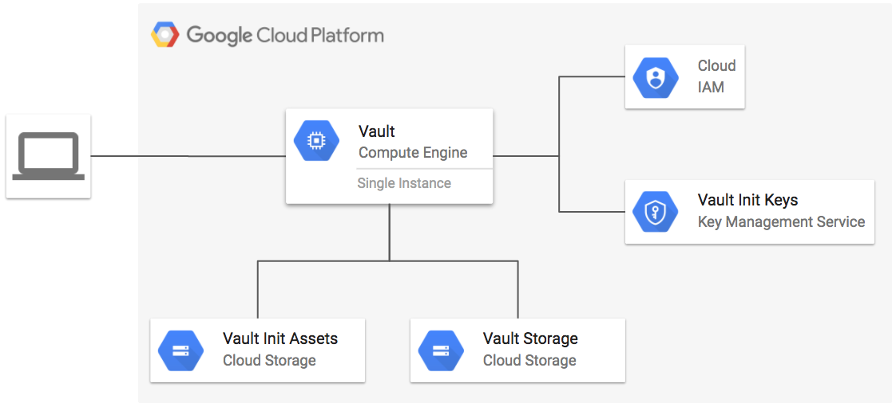

# Vault on GCE Example

**Figure 1.** *diagram of Google Cloud resources*



## Create the Cloud KMS KeyRing for asset encryption:

Cloud KMS is used to encrypt assets like the Vault unseal keys and TLS certificates so they can be securely stored in a Cloud Storage bucket.

Create the key ring and encryption key:

```
gcloud kms keyrings create vault --location global

gcloud kms keys create vault-init --location global --keyring vault --purpose encryption
```

## Set up the environment

Enable the following Google Cloud APIs before continuing:

- Google Compute Engine API
- Google Cloud Storage
- Google Cloud Key Management Service (KMS) API
- Google Identity and Access Management (IAM) API

```
gcloud auth application-default login
export GOOGLE_PROJECT=$(gcloud config get-value project)
```

Add the project ID, bucket name and KeyRing name to the `terraform.tfvars` file:

```
export GOOGLE_PROJECT=$(gcloud config get-value project)
cat - > terraform.tfvars <<EOF
project_id = "${GOOGLE_PROJECT}"
storage_bucket = "${GOOGLE_PROJECT}-vault"
kms_keyring_name = "vault"
EOF
```

## Deploy Vault

```
terraform init
terraform plan
terraform apply
```

After a few minutes, the Vault instance will be ready.

## SSH Into Vault Instnace

Use SSH to connect to the Vault instance:

```
gcloud compute ssh $(gcloud compute instances list --limit=1 --filter=name~vault- --uri) -- sudo bash
```

> Note: the remainder of the commands will be run from within this SSH session.

## Initialize Vault

Obtain the unseal keys from Cloud Storage and decrypt them using Cloud KMS:

```shell
export GOOGLE_PROJECT=$(gcloud config get-value project)
gcloud kms decrypt \
  --location=global  \
  --keyring=vault \
  --key=vault-init \
  --plaintext-file=/dev/stdout \
  --ciphertext-file=<(gsutil cat gs://${GOOGLE_PROJECT}-vault-assets/vault_unseal_keys.txt.encrypted)
```

The output will look like the following:

```
Unseal Key 1: oO1UNH4TPVZRFuGWUa9D0eciJ2LMMgi2PYxm/bLL/lt0
Unseal Key 2: +4q3O9LT46p22uTcDTYZyIVvVt+mxhB8OQ87vZFc3pkp
Unseal Key 3: tFnuYrDD1Xgkec3wFXhk93wIjEfq3kCOD34i16MkE+pl
Unseal Key 4: DFQhkl344Z+jpwr9L/looYjNYPAh8/UKGF5fXAO2Vj0W
Unseal Key 5: XOQVAZCKt6njWcF6IAP19ER1WnRqhH5MllyvcywBLtaw
Initial Root Token: 8d9b6907-0386-c422-cad8-624ceba2d0ae
```

Unseal Vault

```
vault unseal
```

> Run the command above at least 3 times, providing a different unseal key when prompted to unseal Vault.

Verify Vault is unsealed:

```
vault status
```

Authenticate to Vault as root:

```
vault auth ROOT_TOKEN
```

## Configure GCP Auth Backend

Enable GCP auth backend:

```
vault auth-enable gcp
```

Configure GCP backend:

```
vault write auth/gcp/config credentials=@/etc/vault/gcp_credentials.json
```

## Create a Vault role and login with signed JWT

Create a Vault role named `dev-role`:

```
GOOGLE_PROJECT=$(gcloud config get-value project)
vault write auth/gcp/role/dev-role \
  type="iam" \
  project_id="${GOOGLE_PROJECT}" \
  policies="default" \
  service_accounts="vault-admin@${GOOGLE_PROJECT}.iam.gserviceaccount.com"
```

Get a signed JWT for the `dev-role`:

```
GOOGLE_PROJECT=$(gcloud config get-value project)
SERVICE_ACCOUNT=vault-admin@${GOOGLE_PROJECT}.iam.gserviceaccount.com
cat - > login_request.json <<EOF
{
  "aud": "vault/dev-role",
  "sub": "${SERVICE_ACCOUNT}",
  "exp": $((EXP=$(date +%s)+600))
}
EOF
```

```
JWT_TOKEN=$(gcloud beta iam service-accounts sign-jwt login_request.json signed_jwt.json --iam-account=${SERVICE_ACCOUNT} && cat signed_jwt.json)
```

Login to Vault with the signed JWT:

```
curl -s ${VAULT_ADDR}/v1/auth/gcp/login -d '{"role": "dev-role", "jwt": "'${JWT_TOKEN}'"}' | jq -r '.auth.client_token' > ~/.vault-token
```

Test access by writing and reading a value to the cubbyhole

```
vault write /cubbyhole/hello value=world
vault read /cubbyhole/hello
```

Expected output:

```
Key     Value
---     -----
value   world
```